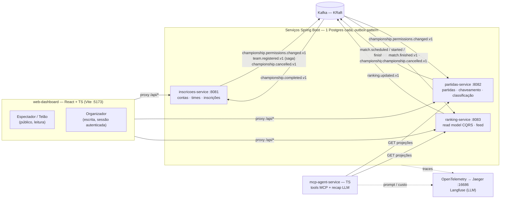
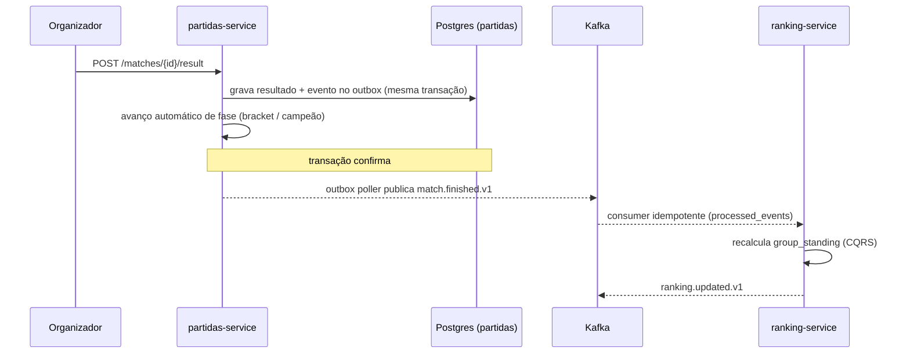

# Championship Platform

Plataforma **event-driven** para gestão de torneios de qualquer modalidade
(futsal, vôlei, xadrez, e-sports, cartas, torneios individuais). Microsserviços
em Java/Spring Boot comunicando-se por Kafka, com um read model CQRS, um painel
web para organizador e espectador, e um agente MCP para consultas em linguagem
natural.

O projeto é uma vitrine de padrões de sistemas distribuídos aplicados a um
domínio real: **transactional outbox**, **consumers idempotentes**, **CQRS**,
**saga coreografada** e **eventos versionados** — com o cuidado de nunca acoplar
serviços por chamada síncrona.

---

## Destaques

- **3 formatos de torneio** — pontos corridos, mata-mata e grupos + mata-mata,
  com sorteio e chaveamento automáticos.
- **Classificação de fonte única** com desempate transparente e auditável:
  `pontos → confronto direto → saldo → pró → vitórias → sorteio visível`
  (nunca um critério oculto). Terminologia neutra de modalidade — `Pró/Contra/Saldo`,
  sem "gols".
- **Regras de gestão reais**: W.O. neutro no placar, desistência de equipe em
  cascata, disputa de 3º lugar, correção de resultado com repropagação do
  bracket, limite de integrantes por equipe, e um log de gestão auditável.
- **Operação do evento**: agendamento com data e **local** (quadra/mesa/tabuleiro),
  detecção de conflito por equipe **e** por local, mesa de controle do dia, e
  rodadas na fase de liga.
- **Inscrição com aprovação**: capitão inscreve o time → organizador aprova →
  confirmação via saga. Delegação de administradores por torneio.
- **Telão** — painel público de parede (kiosk) para projetar numa TV: rotaciona
  entre grade por quadra (ao vivo/próximo), agenda geral, classificação com
  linha de corte e chaveamento, com ticker de resultados e relógio ao vivo.
- **Agente MCP** — tools para consultar classificação/partidas e gerar recaps de
  jogo com LLM, instrumentado com Langfuse.

---

## Arquitetura



**Decisão central:** `partidas-service` nunca chama `ranking-service`. O
resultado de uma partida vira o evento `match.finished.v1` (via outbox) e a
classificação exibida no Monitoramento é uma projeção CQRS recalculada por um
consumer idempotente. A **classificação autoritativa** (a que decide o avanço)
vive no `partidas-service`, que tem os dados de partida para o confronto direto.

### Fluxo de um resultado



---

## Stack

| Camada | Tecnologia |
|---|---|
| Serviços | Java 21, Spring Boot 3, Spring Web, Spring Data JPA |
| Mensageria | Apache Kafka (modo KRaft, sem ZooKeeper) |
| Persistência | PostgreSQL (um banco por serviço), Flyway (migrations) |
| Agente | TypeScript, Model Context Protocol (MCP), Anthropic API |
| Frontend | React, TypeScript, Vite, TanStack Query, React Router |
| Observabilidade | OpenTelemetry, Jaeger (tracing), Langfuse (LLM) |
| Orquestração local | Docker Compose, npm scripts / PowerShell |
| Testes | JUnit 5, Mockito, testes de contrato de evento, e2e via Node |

### Padrões aplicados

- **Transactional outbox** — evento e mudança de estado na mesma transação; um
  poller publica no Kafka depois (nunca publica direto no handler).
- **Consumer idempotente** — tabela `processed_events` deduplica reentregas.
- **CQRS** — o `ranking-service` é um read model alimentado só por eventos.
- **Saga coreografada** — inscrição confirmada por troca de eventos, sem orquestrador.
- **Eventos versionados** — sufixo `.v1`, schema documentado em [`docs/events/`](docs/events/);
  evolução aditiva compatível (ex.: campo `local` adicionado ao `match.scheduled.v1`).

---

## Funcionalidades

<details>
<summary><b>Gestão do torneio</b></summary>

- Criar torneio em 3 formatos, editar (com inscrições abertas) e cancelar
  (estado terminal que purga partidas e projeções via `championship.cancelled.v1`).
- Sorteio e chaveamento automáticos; re-sortear e reabrir inscrições.
- Aprovação de inscrições (capitão → organizador) e delegação de administradores.
- Limite de integrantes por equipe (torneio individual = 1).
</details>

<details>
<summary><b>Durante a competição</b></summary>

- Placar parcial ao vivo, registro de resultado, W.O. (neutro no placar),
  correção com repropagação do bracket, desistência de equipe em cascata.
- Disputa de 3º lugar; classificação com desempate transparente.
- Agendamento com horário e **local**; detecção de conflito por equipe e por local.
- Rodadas na fase de liga ("Rodada 1, 2…") e mesa de controle do dia.
- Log de gestão auditável de todas as ações administrativas.
</details>

<details>
<summary><b>Espectador</b></summary>

- Páginas públicas de torneio, partida, classificação e chaveamento.
- **Telão** (kiosk): rota pública fullscreen que rotaciona entre grade por
  quadra, agenda geral (todos ao vivo + próximos), classificação com linha de
  corte e chaveamento — com ticker de resultados e relógio ao vivo.
</details>

<details>
<summary><b>Agente MCP</b></summary>

- Tools para consultar classificação e partidas com validação de input e
  guardrails contra prompt injection.
- `generate_match_recap` gera um resumo de jogo com LLM (Anthropic), com prompt,
  latência e custo registrados no Langfuse.
</details>

---

## Rodando localmente

Pré-requisitos: **Docker**, **Java 21**, **Node 18+**.

```bash
cp .env.example .env      # ajuste se quiser; o AUTH_SECRET de dev já vem preenchido
npm run dev               # sobe infra + 3 serviços + dashboard (idempotente)
npm run dev:build         # idem, recompilando os jars após mudar código Java
npm run down              # desliga tudo
```

Dashboard em **http://localhost:5173**. No Git Bash/WSL: `bash scripts/dev-up.sh [--build]`.

Agente MCP (opcional, requer `ANTHROPIC_API_KEY`):

```bash
cd mcp-agent-service && npm install && npm run dev
```

### Portas

| Serviço | Porta | | Serviço | Porta |
|---|---|---|---|---|
| inscricoes-service | 8081 | | Postgres | 5432 |
| partidas-service | 8082 | | Kafka | 9092 |
| ranking-service | 8083 | | Kafka UI | 8090 |
| web-dashboard | 5173 | | Jaeger | 16686 |

---

## Testes

```bash
# testes de cada serviço (unitários + contrato de evento)
cd inscricoes-service && ./mvnw test
cd partidas-service   && ./mvnw test
cd ranking-service    && ./mvnw test

# fluxo ponta a ponta nos 3 formatos (requer a stack no ar)
npm run e2e

# frontend
cd web-dashboard && npm run build   # type-check (tsc) + build de produção
```

---

## Estrutura

```
championship-platform/
├── inscricoes-service/   # contas, times, inscrições, permissões  (Java)
├── partidas-service/     # partidas, chaveamento, classificação    (Java)
├── ranking-service/      # read model CQRS + feed de eventos        (Java)
├── mcp-agent-service/    # tools MCP + recap com LLM                (TS)
├── web-dashboard/        # SPA: gestão, espectador e telão          (React/TS)
├── docs/
│   ├── events/           # schema de cada evento .v1
│   └── decisions/        # registros de decisão de arquitetura (ADRs)
├── infra/                # config do OTel Collector, dados locais
├── scripts/              # subir/derrubar a stack, e2e, smoke MCP
└── docker-compose.yml    # Postgres, Kafka (KRaft), Kafka UI, OTel
```

Detalhes funcionais em [SPEC.md](SPEC.md); schema dos eventos em
[docs/events/](docs/events/); decisões de arquitetura em
[docs/decisions/](docs/decisions/).
