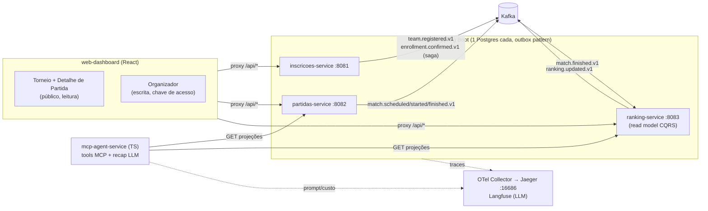

# championship-platform

Plataforma de campeonato orientada a eventos com agente MCP integrado.
Ver [SPEC.md](SPEC.md) para o detalhamento funcional e [ROADMAP.md](ROADMAP.md)
para o plano por semana. Desenvolvimento guiado pela spec (SDD) — mudanças de
comportamento começam por uma atualização do SPEC.md.

## Arquitetura



O ponto central: `partidas-service` **nunca** chama `ranking-service` — o
resultado vira evento (`match.finished.v1`, via transactional outbox) e a
classificação é uma projeção CQRS recalculada pelo consumer idempotente.

## Serviços
| Serviço | Papel | Status |
|---|---|---|
| [inscricoes-service](inscricoes-service/) | Times, jogadores, inscrição em campeonato | Semana 1 — funcional |
| [partidas-service](partidas-service/) | Registro de partidas e resultados | Semana 2 — funcional |
| [ranking-service](ranking-service/) | Projeção de classificação (read model) | Semana 2 — funcional |
| [mcp-agent-service](mcp-agent-service/) | Tools MCP + geração de recap | Semana 3 — funcional |
| [web-dashboard](web-dashboard/) | Dashboard de demonstração (SPA) | Semana 5 — funcional |

## Rodando local

```bash
npm run dev         # sobe tudo: Postgres/Kafka + 3 serviços + dashboard
npm run dev:build   # idem, recompilando os jars antes (após mudar código Java)
npm run down        # desliga tudo
```
No Git Bash ou WSL: `bash scripts/dev-up.sh` (ou `--build`).
Idempotente: o que já estiver no ar é pulado. Logs em `%TEMP%\*.log`.

Serviço MCP (opcional, requer `ANTHROPIC_API_KEY`):
```bash
cd mcp-agent-service
npm install
npm run dev
```

### Portas
| Serviço | Porta |
|---|---|
| inscricoes-service | 8081 |
| partidas-service | 8082 |
| ranking-service | 8083 |
| Postgres | 5432 |
| Kafka | 9092 |
| Kafka UI | 8090 |
| OTel Collector (OTLP gRPC/HTTP) | 4317 / 4318 |

## Semana 1 — o que já existe
- Infra local: `docker-compose.yml` (Postgres com 1 banco por serviço, Kafka
  em modo KRaft, Kafka UI, OTel Collector)
- Eventos `team.registered.v1` e `enrollment.confirmed.v1` documentados em
  [docs/events/](docs/events/)
- `inscricoes-service` completo: cadastro de campeonato, inscrição de time
  (com jogadores), transactional outbox, saga coreografada simples
  (`team.registered.v1` → confirma inscrição → `enrollment.confirmed.v1`),
  consumer idempotente, testes unitários + teste de contrato dos eventos
- `mcp-agent-service`: scaffold TypeScript com as 3 tools do SPEC.md §4
  definidas (schema + guardrails) — falta instrumentação Langfuse (Semana 4)

## Semana 2 — o que já existe
- Eventos `match.scheduled.v1`, `match.finished.v1` e `ranking.updated.v1`
  documentados em [docs/events/](docs/events/)
- `partidas-service` completo: agendar partida, registrar resultado,
  outbox publicando `match.scheduled.v1` / `match.finished.v1`
- `ranking-service` completo: consumer idempotente de `match.finished.v1`,
  read model `group_standing` (CQRS), endpoint
  `GET /groups/{groupId}/standings`, publica `ranking.updated.v1`
- Critério de aceite do SPEC atendido por construção: lançar um resultado
  atualiza o ranking sem nenhuma chamada síncrona entre os serviços

### Testando o fluxo partidas → ranking
```bash
# 1. agendar uma partida (use UUIDs reais de times/campeonato/grupo)
curl -X POST localhost:8082/matches -H 'Content-Type: application/json' -d '{
  "championship_id": "550e8400-e29b-41d4-a716-446655440000",
  "group_id": "6ba7b810-9dad-11d1-80b4-00c04fd430c8",
  "home_team_id": "6ba7b811-9dad-11d1-80b4-00c04fd430c8",
  "home_team_name": "Timaço FC",
  "away_team_id": "6ba7b812-9dad-11d1-80b4-00c04fd430c8",
  "away_team_name": "Rival FC"
}'

# 2. registrar o resultado (use o match_id retornado)
curl -X POST localhost:8082/matches/{matchId}/result \
  -H 'Content-Type: application/json' \
  -d '{"home_score": 2, "away_score": 1}'

# 3. consultar a classificação atualizada via evento (sem chamada síncrona)
curl localhost:8083/groups/6ba7b810-9dad-11d1-80b4-00c04fd430c8/standings
```

### Testando o fluxo do inscricoes-service
```bash
# 1. criar um campeonato
curl -X POST localhost:8081/campeonatos -H 'Content-Type: application/json' \
  -d '{"nome": "Copa Verão 2026"}'

# 2. inscrever um time (use o id retornado acima)
curl -X POST localhost:8081/campeonatos/{campeonatoId}/times \
  -H 'Content-Type: application/json' \
  -d '{"nome": "Timaço FC", "jogadores": ["Jogador 1", "Jogador 2"]}'

# 3. acompanhar em localhost:8090 (Kafka UI): team.registered.v1 publicado,
#    e enrollment.confirmed.v1 publicado logo em seguida pela saga
```

## Semana 3 — o que já existe
- Servidor MCP registrado no repo via [.mcp.json](.mcp.json) — o Claude Code
  detecta e conecta automaticamente ao abrir o projeto
- Tools com guardrails testados: validação de UUID antes de tocar backend,
  falha de backend vira erro estruturado `{error}` (nunca exceção crua),
  dados de domínio delimitados contra prompt injection
- Smoke test de integração MCP: `npx tsx scripts/mcp-smoke.ts <group_id> <match_id>`
  (sobe o servidor via stdio como o Claude faria e exercita as 3 tools)
- `generate_match_recap` funcional — requer `ANTHROPIC_API_KEY` no ambiente

## Semana 5 — o que já existe
- `web-dashboard/` (Vite + React + TS): painel de partidas com registro de
  resultado, classificação ao vivo e **feed de eventos Kafka** — o mesmo
  resultado aparece como `match.finished.v1` consumido e `ranking.updated.v1`
  publicado, tornando o fluxo assíncrono visível na tela
- Novos endpoints: `GET /matches` (partidas-service) e `GET /events/recent`
  (ranking-service), ambos com teste
- Proxy do Vite (sem CORS nos serviços Java, sem BFF) — decisão registrada
  no parecer do tech-lead

```bash
cd web-dashboard && npm install && npm run dev   # http://localhost:5173
```

## Semana 4 — observabilidade
- **Traces ponta a ponta no Jaeger** (http://localhost:16686): o trace da
  publicação de `match.finished.v1` no partidas-service continua no consumer
  do ranking-service — um único trace cruzando os dois serviços via Kafka,
  incluindo o span customizado `ranking-service.recalculate_group`
- Nota de arquitetura: com transactional outbox, o trace do HTTP request
  termina na escrita do outbox **por design** (a publicação acontece em outra
  transação, via poller) — o trace do hop Kafka nasce no poller
- **Langfuse** no `generate_match_recap`: prompt, resposta, latência e tokens
  registrados a cada geração (configure `LANGFUSE_PUBLIC_KEY`/`SECRET_KEY`)
- **Eval do recap**: dataset golden com checagem determinística de
  consistência factual (placar, nomes, anti-injection):
  `cd mcp-agent-service && npx tsx scripts/eval-recap.ts`
- Rascunho de post: [docs/linkedin-post.md](docs/linkedin-post.md)

## Subindo a stack completa (após reboot/primeira vez)
```powershell
powershell -ExecutionPolicy Bypass -File scripts\dev-up.ps1
```
Sobe Docker Compose, aguarda o Kafka ficar saudável, empacota e inicia os
3 serviços Spring, e imprime as portas. Use `-SkipBuild` se os jars já existem.

## Convenções
Ver [CLAUDE.md](CLAUDE.md) e `.claude/skills/` para convenções de código,
eventos e observabilidade seguidas neste repo.
